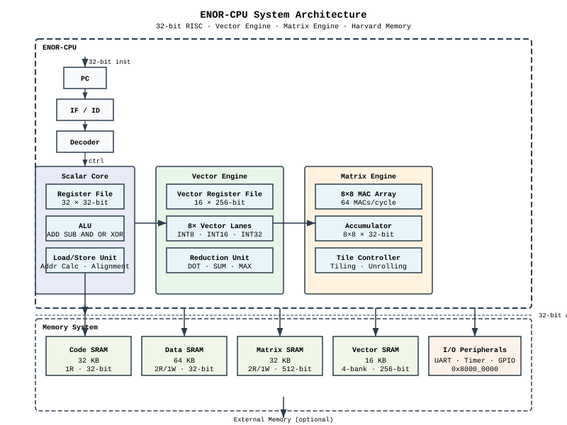
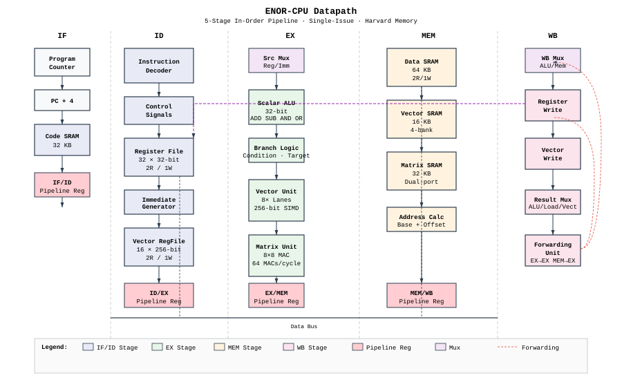

# ENOR-CPU

### A Custom AI-Oriented RISC Processor Architecture

ENOR-CPU is a custom 32-bit RISC processor designed as the native hardware target for the Enor programming language. It features dedicated vector and matrix execution engines for AI/ML workloads, with a Harvard memory architecture optimized for quantized integer computation. The architecture implements a 5-stage in-order pipeline with 256-bit vector SIMD and an 8×8 INT8 matrix multiply-accumulate unit, providing a complete software-to-hardware stack for AI inference execution.

---

## 1. System Architecture

ENOR-CPU implements a complete execution stack from high-level language to hardware computation. The Enor compiler translates Enor programs into ENOR-CPU machine code, targeting three specialized execution domains: scalar control, vector computation, and matrix acceleration.



The architecture separates concerns across three execution domains:

- **Scalar Core** — Program flow control, address computation, and general-purpose integer operations
- **Vector Engine** — Element-wise and reduction operations across 256-bit datapaths
- **Matrix Engine** — Dense matrix multiplication via an 8×8 INT8 multiply-accumulate array

This is not a general-purpose CPU with AI extensions bolted on. It is an AI-oriented processor with general-purpose control capabilities.

---

## 2. Processor Architecture

ENOR-CPU implements a 32-bit RISC-style architecture with the following characteristics:

| Property | Value |
|----------|-------|
| Architecture width | 32-bit |
| Instruction width | 32-bit fixed |
| Execution model | 5-stage in-order pipeline |
| Issue width | Single-issue |
| Branch prediction | None (2-cycle penalty) |
| Memory model | Harvard (separate code/data) |
| Endianness | Little-endian |
| Reset | Asynchronous active-low |

### 2.1 Design Principles

- **Implementability** — Small enough for single-engineer implementation and verification
- **Simplicity** — No speculative execution or out-of-order logic
- **Verifiability** — Deterministic execution, straightforward to test
- **AI Utility** — First-class support for matrix multiply, vector operations, and quantized arithmetic
- **FPGA Feasibility** — Targets mid-range FPGA (Xilinx Artix-7 or equivalent)

### 2.2 Execution Model

ENOR-CPU uses a static scheduling model where the compiler explicitly assigns operations to execution slots. Each cycle, the processor can dispatch:

- 1 scalar instruction (control flow, address computation)
- 1 vector instruction (element-wise, reduction)
- 1 matrix instruction (multiply, MAC)

Unused slots execute NOP. This avoids the complexity of dynamic scheduling while enabling parallelism across execution domains.

---

## 3. Compute Architecture

ENOR-CPU organizes computation across three specialized execution domains, each optimized for distinct operation patterns common in AI workloads.

### 3.1 Scalar Core

The scalar core handles program flow control, address generation, and general-purpose integer computation.

| Component | Specification |
|-----------|---------------|
| Registers | 32 × 32-bit (x0-x31) |
| ALU operations | ADD, SUB, AND, OR, XOR, SLL, SRL, SRA, SLT, SLTU |
| Immediate operations | ADDI, ANDI, ORI, XORI, SLLI, SRLI, SRAI |
| Control flow | BEQ, BNE, BLT, BGE, BLTU, BGEU, JAL, JALR |
| Memory access | LB, LH, LW, LBU, LHU, SB, SH, SW |
| Special | LUI, AUIPC, ECALL, EBREAK, CSRRW |

The scalar register file implements 2-read, 1-write ports with write-first semantics. Register x0 is hardwired to zero (writes ignored).

### 3.2 Vector Engine

The vector engine provides 256-bit SIMD execution for element-wise and reduction operations. Each vector register holds 8 × INT32, 4 × INT16, or 8 × INT8 elements, with the active vector length controlled by the VL register (1-8 elements).

| Component | Specification |
|-----------|---------------|
| Registers | 16 × 256-bit (v0-v15) |
| Datapath width | 256 bits (8 × INT32 lanes) |
| Vector length | Configurable 1-8 via VL register |
| Element types | INT8, INT16, INT32 |
| Operations | VADD, VSUB, VMUL, VDOT, VRED_SUM |
| Memory | VLW (256-bit burst load), VSW (256-bit burst store) |

Vector execution is useful for AI workloads because:

- Activation functions (ReLU, sigmoid) are element-wise operations
- Normalization layers compute per-element statistics
- Data transformations (padding, reshaping) operate on contiguous memory
- Dot products form the inner loop of convolution and matrix operations

### 3.3 Matrix Engine

The matrix engine provides a hardware execution path for neural-network-style matrix operations. It implements an 8×8 INT8 multiply-accumulate array that computes matrix products directly in hardware.

| Component | Specification |
|-----------|---------------|
| MAC array | 8×8 INT8 multipliers |
| Accumulator | 8×8 × 32-bit (2048 bits) |
| Operations | MMUL (matrix multiply), MMAC (multiply-accumulate) |
| Memory | MLOAD (load matrix to accumulator), MSTORE (store result) |
| Dimensions | Controlled by VLX, VLY, VLZ CSRs (1-8) |
| Latency | max(VLX, VLY, VLZ) cycles (pipelined) |

The matrix engine provides a hardware execution path for neural network inference because:

- Matrix multiplication is the dominant operation in fully-connected layers
- Convolution can be expressed as matrix multiplication via im2col
- INT8 quantization is sufficient for inference with minimal accuracy loss
- 32-bit accumulation prevents overflow during summation

---

## 4. Microarchitecture

ENOR-CPU implements a classic 5-stage in-order pipeline with separate execution units for scalar, vector, and matrix operations.



### 4.1 Pipeline Stages

| Stage | Name | Function |
|-------|------|----------|
| IF | Instruction Fetch | Fetch 32-bit instruction from code SRAM |
| ID | Instruction Decode | Decode instruction, read register files, generate control signals |
| EX | Execute | ALU operation, vector/matrix execution, branch resolution |
| MEM | Memory Access | Data memory read/write, SRAM access |
| WB | Write Back | Write result to register file |

### 4.2 Pipeline Characteristics

- **Depth:** 5 stages
- **Issue width:** 1 instruction per cycle (scalar)
- **Execution:** In-order, no speculation
- **Hazards:** Stalled, not speculated
- **Branch penalty:** 2 cycles (taken branches flush IF and ID stages)

### 4.3 Hazard Handling

| Hazard Type | Detection | Resolution | Penalty |
|-------------|-----------|------------|---------|
| Data (RAW) | EX stage | Forwarding | 0 cycles |
| Load-use | EX stage | Stall + forward | 1 cycle |
| Control (branch) | EX stage | Flush + redirect | 2 cycles |
| Memory conflict | MEM stage | Stall | Variable |

The forwarding network supports EX→EX, MEM→EX, and WB→EX bypass paths.

### 4.4 Instruction Latency

| Instruction Class | Latency | Notes |
|-------------------|---------|-------|
| ALU (R/I-type) | 1 cycle | Single-cycle execute |
| Load | 2 cycles | 1 for address, 1 for memory |
| Store | 2 cycles | 1 for address, 1 for write |
| Branch (taken) | 3 cycles | 1 fetch, 1 decode, 1 redirect |
| Branch (not taken) | 1 cycle | Proceeds normally |
| JAL | 2 cycles | 1 fetch, 1 redirect |
| JALR | 3 cycles | 1 fetch, 1 decode, 1 redirect |
| Vector (VADD/VSUB/VMUL) | 1 cycle | 8 ops/cycle |
| VDOT / VRED_SUM | VL cycles | Serial accumulation |
| MMUL (8×8) | 8 cycles | Pipelined MAC array |
| MLOAD / MSTORE | VLX cycles | Burst transfer |

---

## 5. Instruction Set Architecture

ENOR-CPU implements a 50-instruction ISA with fixed 32-bit encoding. The ISA is organized into six categories: integer arithmetic, memory operations, control flow, vector operations, matrix operations, and system operations.

### 5.1 Instruction Summary

| Category | Count | Instructions |
|----------|-------|--------------|
| Integer Arithmetic | 19 | ADD, ADDI, SUB, AND, OR, XOR, ANDI, ORI, XORI, SLL, SRL, SRA, SLLI, SRLI, SRAI, SLT, SLTU, SLTI, SLTIU, LUI, AUIPC |
| Memory | 8 | LB, LH, LW, LBU, LHU, SB, SH, SW |
| Control Flow | 8 | BEQ, BNE, BLT, BGE, BLTU, BGEU, JAL, JALR |
| Vector | 8 | VLW, VSW, VADD, VSUB, VMUL, VDOT, VRED_SUM, VSETVL |
| Matrix | 4 | MMUL, MMAC, MLOAD, MSTORE |
| System | 3 | ECALL, EBREAK, CSRRW |

### 5.2 Instruction Encoding Formats

All instructions use fixed 32-bit width with the following formats:

**R-type (Register-Register)**
```
31       25 24    20 19    15 14   12 11     7 6      0
+-----------+--------+--------+------+--------+--------+
|  funct7   |  rs2   |  rs1   |funct3|   rd   | opcode |
|  (7 bits) |(5 bits)|(5 bits)|(3b)  |(5 bits)|(7 bits)|
+-----------+--------+--------+------+--------+--------+
```

**I-type (Immediate)**
```
31           20 19    15 14   12 11     7 6      0
+--------------+--------+------+--------+--------+
|   imm[11:0]  |  rs1   |funct3|   rd   | opcode |
|   (12 bits)  |(5 bits)|(3b)  |(5 bits)|(7 bits)|
+--------------+--------+------+--------+--------+
```

**S-type (Store)**
```
31       25 24    20 19    15 14   12 11     7 6      0
+-----------+--------+--------+------+--------+--------+
|imm[11:5]  |  rs2   |  rs1   |funct3|imm[4:0]| opcode |
| (7 bits)  |(5 bits)|(5 bits)|(3b)  |(5 bits)|(7 bits)|
+-----------+--------+--------+------+--------+--------+
```

**B-type (Branch)**
```
31 30       25 24    20 19    15 14   12 11    8  7  6      0
+--+----------+--------+--------+------+-------+--+--------+
|12|imm[10:5] |  rs2   |  rs1   |funct3|imm[4:1]|11| opcode |
+--+----------+--------+--------+------+-------+--+--------+
```

**U-type (Upper Immediate)**
```
31                                 12 11     7 6      0
+------------------------------------+--------+--------+
|         imm[31:12]                 |   rd   | opcode |
|           (20 bits)                |(5 bits)|(7 bits)|
+------------------------------------+--------+--------+
```

**J-type (Jump)**
```
31 30       21 20 19        12 11     7 6      0
+--+----------+--+------------+--------+--------+
|20|imm[10:1] |11| imm[19:12] |   rd   | opcode |
|  | (10 bits)|  |  (8 bits)  |(5 bits)|(7 bits)|
+--+----------+--+------------+--------+--------+
```

**V-type (Vector)**
```
31       25 24    20 19    15 14   12 11     7 6      0
+-----------+--------+--------+------+--------+--------+
|  funct7   |  vs2   |  vs1   |funct3|   vd   | opcode |
|  (7 bits) |(5 bits)|(5 bits)|(3b)  |(5 bits)|(7 bits)|
+-----------+--------+--------+------+--------+--------+
```

### 5.3 Opcode Map

| Opcode | Format | Category | Instructions |
|--------|--------|----------|--------------|
| 0x03 | I-type | Load | LB, LH, LW, LBU, LHU |
| 0x13 | I-type | Arithmetic (imm) | ADDI, ANDI, ORI, XORI, SLLI, SRLI, SRAI, SLTI, SLTIU |
| 0x17 | U-type | AUIPC | AUIPC |
| 0x23 | S-type | Store | SB, SH, SW |
| 0x33 | R-type | Arithmetic (reg) | ADD, SUB, AND, OR, XOR, SLL, SRL, SRA, SLT, SLTU |
| 0x37 | U-type | LUI | LUI |
| 0x57 | V-type | Vector | VADD, VSUB, VMUL, VDOT, VRED_SUM, VSETVL |
| 0x63 | B-type | Branch | BEQ, BNE, BLT, BGE, BLTU, BGEU |
| 0x67 | I-type | JALR | JALR |
| 0x6F | J-type | JAL | JAL |
| 0x73 | I-type | System | ECALL, EBREAK, CSRRW |
| 0x77 | R/I/S | Matrix | MMUL, MMAC, MLOAD, MSTORE |

---

## 6. Register Architecture

ENOR-CPU has three classes of architecturally visible registers plus a memory-mapped matrix accumulator.

| Register Class | Registers | Width | Purpose |
|----------------|----------:|------:|---------|
| Scalar (x0-x31) | 32 | 32-bit | General-purpose integer operations, control flow |
| Vector (v0-v15) | 16 | 256-bit | SIMD element-wise and reduction operations |
| Matrix Accumulator (M0) | 1 | 8×8×32-bit | Matrix multiply-accumulate results |
| Program Counter (PC) | 1 | 32-bit | Instruction address |
| Status Register (SR) | 1 | 32-bit | ALU flags (Z, C, V, N), interrupt enable (IE) |
| Vector Length (VL) | 1 | 32-bit | Active vector elements (1-8) |
| Matrix Dimension X (VLX) | 1 | 32-bit | Matrix column count (1-8) |
| Matrix Dimension Y (VLY) | 1 | 32-bit | Matrix row count (1-8) |
| Matrix Depth (VLZ) | 1 | 32-bit | Accumulation depth (1-8) |

### 6.1 Scalar Registers

| Register | ABI Name | Description |
|----------|----------|-------------|
| x0 | zero | Hardwired to 0 (reads return 0, writes ignored) |
| x1 | ra | Return address |
| x2 | sp | Stack pointer |
| x3 | gp | Global pointer (optional) |
| x4 | tp | Thread pointer (reserved) |
| x5-x7 | t0-t2 | Temporaries (caller-saved) |
| x8-x9 | s0-s1 | Saved registers (callee-saved) |
| x10-x11 | a0-a1 | Function arguments / return values |
| x12-x17 | a2-a7 | Function arguments (caller-saved) |
| x18-x27 | s2-s11 | Saved registers (callee-saved) |
| x28-x31 | t3-t6 | Temporaries (caller-saved) |

### 6.2 Vector Registers

Each vector register is 256 bits wide and holds multiple elements based on element width:

| Element Type | Elements | Bits per Element | Pack Density |
|--------------|----------|------------------|--------------|
| INT8 | 8 | 8 | 100% |
| INT16 | 4 | 16 | 50% |
| INT32 | 2 | 32 | 25% |

Vector length is controlled by the VL register (values 1-8), allowing efficient operation on sub-word data without wasted cycles.

### 6.3 Control/Status Registers

CSR registers are accessed via CSRRW, CSRRS, and CSRRC instructions:

| CSR Address | Name | Description |
|-------------|------|-------------|
| 0x000 | SR | Status register (Z, C, V, N flags, IE bit) |
| 0x001 | VL | Vector length (1-8) |
| 0x002 | VLX | Matrix dimension X (columns) |
| 0x003 | VLY | Matrix dimension Y (rows) |
| 0x004 | VLZ | Matrix depth (accumulation dimension) |
| 0x010 | EPC | Exception program counter |
| 0x011 | ECAUSE | Exception cause |
| 0x020 | IE | Interrupt enable |
| 0x100 | M0_ADDR | Matrix accumulator base address |
| 0x101 | M0_DIMX | Matrix dimension X |
| 0x102 | M0_DIMY | Matrix dimension Y |

---

## 7. Memory Architecture

ENOR-CPU uses a modified Harvard architecture with separate address spaces for code, data, and I/O. All memory is memory-mapped with no virtual memory.

### 7.1 Memory Map

| Region | Address Range | Size | Purpose |
|--------|---------------|-----:|---------|
| Code SRAM | 0x00000000 - 0x00007FFF | 32 KB | Instruction storage (read-only from CPU) |
| Data SRAM | 0x40000000 - 0x4000FFFF | 64 KB | General-purpose data (read/write) |
| Matrix SRAM | 0x40000000 - 0x40007FFF | 32 KB | Matrix tile storage (dual-port) |
| Vector SRAM | 0x40000000 - 0x40003FFF | 16 KB | Vector data storage (4-bank) |
| Matrix Accumulator | 0x40000000 - 0x400000FF | 256 B | M0 accumulator (memory-mapped) |
| UART | 0x80000000 | 4 B | Serial data register |
| UART Status | 0x80000004 | 4 B | Serial status register |
| Timer | 0x80000008 | 4 B | Timer value |
| Timer Compare | 0x8000000C | 4 B | Timer compare value |
| GPIO Output | 0x80000010 | 4 B | GPIO output register |
| GPIO Input | 0x80000014 | 4 B | GPIO input register |
| Interrupt Enable | 0x80000018 | 4 B | Interrupt enable register |
| Interrupt Status | 0x8000001C | 4 B | Interrupt status register |

### 7.2 Memory Organization

| SRAM | Size | Ports | Width | Purpose |
|------|-----:|-------|------:|---------|
| Code SRAM | 32 KB | 1R | 32-bit | Instruction fetch |
| Data SRAM | 64 KB | 2R/1W | 32-bit | Scalar data access |
| Matrix SRAM | 32 KB | 2R/1W | 512-bit | Matrix tile storage |
| Vector SRAM | 16 KB | 4-bank | 256-bit | Vector data storage |

### 7.3 Memory Access Patterns

| Operation | Width | Alignment | Latency |
|-----------|------:|-----------|--------:|
| Instruction fetch | 32 bits | 4-byte | 1 cycle |
| Scalar load/store | 8/16/32 bits | Byte/half/word | 2 cycles |
| Vector load/store | 256 bits | 32-byte | 1 cycle |
| Matrix load/store | 512 bits | 32-byte | VLX cycles |

Separate memory regions enable simultaneous access from multiple execution units without structural hazards, providing sufficient bandwidth for AI-oriented data movement patterns.

---

## 8. AI Execution Model

ENOR-CPU provides a hardware execution path for quantized neural network inference. The architecture supports INT8 computation with INT32 accumulation, vector arithmetic for element-wise operations, and matrix multiplication for dense linear algebra.

### 8.1 Quantized Computation

| Operation | Input | Accumulation | Output |
|-----------|-------|--------------|--------|
| Matrix multiply | INT8 × INT8 | INT32 | INT32 |
| Vector multiply | INT8 × INT8 | — | INT8/INT16/INT32 |
| Dot product | INT8 × INT8 | INT32 | INT32 |

### 8.2 AI Workload Pipeline

```
AI workload
    ↓
Enor operation
    ↓
ENOR ISA instruction
    ↓
Dedicated execution unit
    ↓
Hardware computation
```

The Enor compiler maps high-level AI operations to ENOR-CPU instructions:

- **Matrix multiplication** → MMUL / MMAC instructions
- **Vector element-wise ops** → VADD / VSUB / VMUL instructions
- **Dot products** → VDOT instruction
- **Reductions** → VRED_SUM instruction
- **Activation functions** → VADD / VSUB with scalar broadcast
- **Data movement** → VLW / VSW / MLOAD / MSTORE instructions

### 8.3 Data Movement Patterns

The architecture supports efficient data movement for common AI patterns:

**Weight Stationary** — Weights loaded once to matrix SRAM, activations streamed via vector loads, results accumulated in M0.

**Output Stationary** — Partial results held in M0 accumulator, weights and activations streamed, final result written out via MSTORE.

---

## 9. ISA Encoding

ENOR-CPU uses fixed 32-bit instruction encoding with RISC-V-compatible field positions where applicable.

### 9.1 Encoding Principles

1. **Fixed width:** Always 32 bits (4 bytes)
2. **Regular fields:** Opcode always in bits [6:0]
3. **Register fields:** 5 bits (supports up to 32 registers)
4. **Immediate fields:** Sign-extended as needed
5. **Byte ordering:** Little-endian

### 9.2 Funct3 Encoding

**R-type (opcode 0x33):**

| Funct3 | Funct7 | Instruction |
|--------|--------|-------------|
| 0x00 | 0x00 | ADD |
| 0x00 | 0x20 | SUB |
| 0x01 | 0x00 | SLL |
| 0x02 | 0x00 | SLT |
| 0x03 | 0x00 | SLTU |
| 0x04 | 0x00 | XOR |
| 0x05 | 0x00 | SRL |
| 0x05 | 0x20 | SRA |
| 0x06 | 0x00 | OR |
| 0x07 | 0x00 | AND |

**I-type (opcode 0x13):**

| Funct3 | Funct7 | Instruction |
|--------|--------|-------------|
| 0x00 | — | ADDI |
| 0x01 | 0x00 | SLLI |
| 0x02 | — | SLTI |
| 0x03 | — | SLTIU |
| 0x04 | — | XORI |
| 0x05 | 0x00 | SRLI |
| 0x05 | 0x20 | SRAI |
| 0x06 | — | ORI |
| 0x07 | — | ANDI |

**V-type (opcode 0x57):**

| Funct7 | Instruction |
|--------|-------------|
| 0x00 | VADD |
| 0x02 | VSUB |
| 0x04 | VMUL |
| 0x10 | VDOT |
| 0x11 | VRED_SUM |
| 0x20 | VSETVL |

**Matrix (opcode 0x77):**

| Funct7 | Funct3 | Instruction |
|--------|--------|-------------|
| 0x00 | 0x00 | MMUL |
| 0x01 | 0x00 | MMAC |
| 0x02 | 0x00 | MLOAD |
| 0x03 | 0x01 | MSTORE |

### 9.3 Immediate Encoding

**I-type:** 12-bit signed immediate, range -2048 to 2047.

**S-type:** 12-bit signed immediate split across imm[11:5] and imm[4:0].

**B-type:** 13-bit signed immediate (multiple of 2), split across four fields.

**U-type:** 20-bit upper immediate, shifted left by 12.

**J-type:** 21-bit signed immediate (multiple of 2), split across four fields.

---

## 10. Hardware Organization

```
ENOR-CPU
│
├── Control Core
│   ├── Program Counter (32-bit)
│   ├── Instruction Decoder
│   ├── Scalar Register File (32 × 32-bit, 2R/1W)
│   ├── ALU (32-bit, single-cycle)
│   └── Load/Store Unit
│
├── Vector Engine
│   ├── Vector Register File (16 × 256-bit, 2R/1W)
│   ├── 8× Vector Lanes (INT8/INT16/INT32)
│   ├── Reduction Unit (DOT, SUM, MAX)
│   └── Vector Load/Store Interface
│
├── Matrix Engine
│   ├── 8×8 Multiply Array (INT8)
│   ├── Accumulator (8×8 × 32-bit)
│   ├── Weight Buffer
│   └── Tile Controller
│
├── Memory System
│   ├── Code SRAM (32 KB, 1R, 32-bit)
│   ├── Data SRAM (64 KB, 2R/1W, 32-bit)
│   ├── Matrix SRAM (32 KB, 2R/1W, 512-bit)
│   └── Vector SRAM (16 KB, 4-bank, 256-bit)
│
├── Pipeline Control
│   ├── Hazard Detection Unit
│   ├── Forwarding Network
│   └── Stall/Flush Logic
│
└── I/O Subsystem
    ├── UART (8N1, 115200 baud)
    ├── 32-bit Timer
    ├── 8-bit GPIO
    └── Interrupt Controller
```

### 10.1 Pipeline Control

The pipeline control unit implements:

- **Hazard Detection** — Detects RAW data hazards, load-use hazards, and control hazards
- **Forwarding Network** — EX→EX, MEM→EX, WB→EX bypass paths
- **Stall Logic** — Inserts bubbles for load-use hazards (1-cycle stall)
- **Flush Logic** — Flushes IF and ID stages on taken branches (2-cycle penalty)

### 10.2 Reset State

| Register | Reset Value | Notes |
|----------|-------------|-------|
| PC | 0x00000000 | Start of code space |
| SR | 0x00000000 | Interrupts disabled |
| VL | 0x00000008 | 8 elements |
| VLX | 0x00000008 | 8 columns |
| VLY | 0x00000008 | 8 rows |
| VLZ | 0x00000008 | 8 depth |
| x0 | 0x00000000 | Hardwired |
| x1-x31 | Undefined | Must be initialized by software |
| v0-v15 | Undefined | Must be initialized by software |

---

## 11. Verification

ENOR-CPU verification is performed through a multi-layered approach comparing behavioral simulation against the reference model.

### 11.1 Verification Components

| Component | Description |
|-----------|-------------|
| Python reference simulator | Golden reference implementing complete ISA |
| Assembler | Translates assembly to binary |
| SystemVerilog RTL | Hardware implementation |
| Automated testbench | Compares simulator vs RTL output |

### 11.2 Test Categories

| Category | Description |
|----------|-------------|
| Scalar instruction tests | All integer arithmetic, logic, shift, compare, memory, branch, jump operations |
| Vector instruction tests | VADD, VSUB, VMUL, VDOT, VRED_SUM with various VL settings |
| Matrix instruction tests | MMUL, MMAC, MLOAD, MSTORE with 1×1, 4×4, 8×8 tiles |
| System instruction tests | ECALL, EBREAK, CSRRW operations |
| Integration tests | Function call/return, loops, vector loops, matrix tiling |
| Program tests | Fibonacci, dot product, matrix multiply, simple neural network layer |

### 11.3 Verification Methodology

The reference simulator provides deterministic execution of all 42 instructions. RTL simulation output is compared against the simulator on an instruction-by-instruction basis, verifying:

- Register state after each instruction
- Memory state after load/store operations
- Control flow (branch/jump targets)
- Flag generation (Z, C, V, N)
- Vector element operations
- Matrix accumulation results

---

## 12. Technical Specification

| Property | Specification |
|----------|---------------|
| Architecture | ENOR-CPU |
| ISA | 32-bit fixed-width, RISC-style |
| Instructions | 50 |
| Execution | 5-stage in-order pipeline |
| Issue width | Single-issue |
| Scalar registers | 32 × 32-bit |
| Vector registers | 16 × 256-bit |
| Matrix accumulator | 8 × 8 × 32-bit (2048 bits) |
| Code SRAM | 32 KB |
| Data SRAM | 64 KB |
| Matrix SRAM | 32 KB |
| Vector SRAM | 16 KB |
| Total on-chip SRAM | 144 KB |
| Floating point | Not implemented (INT8/INT16/INT32 only) |
| Branch prediction | None (2-cycle penalty) |
| Cache | None (SRAM only) |
| Memory protection | None |
| Virtual memory | None |
| RTL | SystemVerilog |
| Reference model | Python |
| Target FPGA | AMD/Xilinx Artix-7 (XC7A100T) or equivalent |
| Peripherals | UART, 32-bit timer, 8-bit GPIO |
| Interrupt model | Vectored (2 sources + error) |
